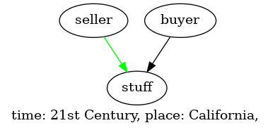

# PSL Tutorial

# What is PSL?

PSL is a programming language that allows you to create a model of a domain space, and update it 
over time. PSL mimics the syntax of `JavaScript` but is only declarative in nature i.e,
there are no such things as functions.

# Benefits

1. *Short and Concise:* PSL forces you to be think more and write less, and be as concise as possible.
2. *Extensibility:* Any domain knowledge written in PSL can easily be extended further by someone else by `import`ing
and building upon it. In execution, all domain knowledge merges into one runtime database, accessible using a dot(`.`) notation.
3. *Hypothesis and Proofs:* PSL lets you provide proofs for any new relation you create, thereby emphasizing the validity of the information. Proofs can be formal or informal such as proof by examples.
4. *Dependence and Breakage:* PSL treats domain knowledge as building blocks. Higher level blocks are dependent on lower level blocks. Devalidation of a hypothesis at a lower level block immediately devalidates the higher level block that is dependent on it, providing a clear 
indication that something needs to be fixed.
5. *Shelling:* Since all domain knowledge cannot be known altogether, you can create entities without specifying what they are and continue to build upon them. Then define them later at some point when more information is known.
6. *Integration:* Since PSL is a programming language, it integrates with all the programming tools you already use such as GitHub for repository,Git for Version Control, Pull requests for peer reviews and your favourite code editor.


# Example

We will cover the working of PSL using an example of a domain space called a market. A market is where
some people sell stuff while others buy it. We will also cover the entities involved and the interactions
among them. There are few things we know for a fact while others are unproven hypothesis. PSL provides a
way of working that allows you to clearly differenciate between the two.

## Basics

Lets understand the basic objects of PSL.

### Domain

Domains are highest level structures. All entities and their interactions exist within the domain space.

You define a new domain space `market` as:
```
domain market {

}
```
### Context

Every interaction in a domain space happens with a context. You can add a `Context` to your domain space `market` as:

```
domain market {
    context {

    }
}
```

Now, we can add some properties to our `context` which define the context of what we will define later. These properties 
can be anything you like. Let's add a `time` and `place`.


```
domain market {
    context {
        time = '21st Century',
        place = 'California'
    }
}
```

### Entity

Entities are objects that exist within a domain space that can have interactions or can be related to one another. You can add
an `entity` and give them properties which demonstrated as following:

```
domain market {
    context {
        time = '21st Century',
        place = 'California'
    }

    entity seller {
        description = 'People who sell stuff.'
    }
}
```

Now lets add another entity called `buyers` which are people who buy stuff.

```
domain market {
    context {
        time = '21st Century',
        place = 'California'
    }

    entity seller {
        description = 'People who sell stuff.'
    }

    entity buyer {
        description = 'People who buy stuff.'
    }
}
```

Note that the entities `seller` and `buyer` a not directly related to each other but rather to another entity called `stuff` which 
isn't defined yet. So lets define that:

```
domain market {
    context {
        time = '21st Century',
        place = 'California'
    }

    entity seller {
        description = 'People who sell stuff.'
    }

    entity buyer {
        description = 'People who buy stuff.'
    }

    entity stuff {
        description = 'Things that can be bought or sold.'
    }
}
```

### Relation

Relations exist between entities and connect them. Lets define a relation between a `seller` and `stuff`, and between `stuff` and `buyer`.

```
domain market {
    context {
        time = '21st Century',
        place = 'California'
    }

    entity seller {
        description = 'People who sell stuff.'
    }

    entity buyer {
        description = 'People who buy stuff.'
    }

    entity stuff {
        description = 'Things that can be bought or sold.'
    }

    relation selling_stuff (seller, stuff) {
        description = 'Seller sells stuff.'
    }

    relation buying_stuff (buyer, stuff) {
        description = 'Buyer buys stuff.'
    }
}
```

Now, lets revisit the two relations `selling_stuff` and `buying_stuff` we have created.
Are `sellers` always `selling_stuff`? No. They only sell when they don't need it.
Similar, `buyers` are only `buying_stuff` when they need it.

So let's update our relations.

```
domain market {
    context {
        time = '21st Century',
        place = 'California'
    }

    entity seller {
        description = 'People who sell stuff.'
    }

    entity buyer {
        description = 'People who buy stuff.'
    }

    entity stuff {
        description = 'Things that can be bought or sold.'
    }

    relation selling_stuff (seller, stuff) {
        description = 'Seller sells stuff when they don't need it.'
    }

    relation buying_stuff (buyer, stuff) {
        description = 'Buyer buys stuff when they need it.'
    }
}
```

Now save this file as `market.psl`.

### Imports

Imagine all of the above work was done by your collegue and you want to build upon it. Thats where `import`s come in.
Create a new file `extension.psl` and lets import our collegue's work:

```
import market from `market.psl`

market extension extends market {
    
    context {
        ... // making sure the context is the same
    }

}

```
Now, we can extend this `market` domain and build upon it.


### Proofs

The previous we defined relation `selling_stuff`. How do we know it is true? That's where `Proof`s come in.

Lets create a `Proof` for it. `Proof`s can be `formal` or `informal`. Here we will use add
informal proof by example.

```
import market from `market.psl`

market extension extends market {
    
    context {
        ... // making sure the context is the same
    }

    proof (selling_stuff) {
        type = 'informal',
        detail = '''
            I interviewed 5 sellers. All of them said they only sold the stuff they didn't need anymore.
            Interview videos are present in our Google Drive in folder User Interviews
            https://drive.google.com/file/d/1adasdaRo/view?usp=sharing
            https://drive.google.com/file/d/1adasRoww/view?usp=sharing
            https://drive.google.com/file/d/1ad232sdaRo/view?usp=sharing
            https://drive.google.com/file/d/1a121341o/view?usp=sharing
            https://drive.google.com/file/d/135234Ro/view?usp=sharing

        '''
    }

}

```
Now, it is up to our other collegues to review it during our GitHub pull request and comment if they think the Proof isn't good enough.

## Execution

Now that we have some PSL code written. Lets run it inside a shell:

```
psl shell market.psl
```

```
PSL > 
```
Access context:
```
PSL > market.context
```
prints:
```
time is 21st Century
place is California
```
Access entities in our domain space:
```
PSL > market.entities
```
prints `seller, buyer, stuff`

Access entity properties:
```
PSL > market.entities.seller.description
```
prints `People who sell stuff`

Access relations:
```
PSL > market.relations.selling_stuff.proven
```
prints `Yes`

Access proof:
```
PSL > market.relations.selling_stuff.proof
```
Prints:
```
Proof type: Informal
Proof:
I interviewed 5 sellers. All of them said they only sold the stuff they didn't need anymore.
Interview videos are present in our Google Drive in folder User Interviews
https://drive.google.com/file/d/1adasdaRo/view?usp=sharing
https://drive.google.com/file/d/1adasRoww/view?usp=sharing
https://drive.google.com/file/d/1ad232sdaRo/view?usp=sharing
https://drive.google.com/file/d/1a121341o/view?usp=sharing
https://drive.google.com/file/d/135234Ro/view?usp=sharing

```

# Visualization

To generate a visual representation of our domain space, run:
```
psl market.psl graph
```

And you will get the following:


Note that here, one relation is shown with a green arrow showing that this relation has a proof.


